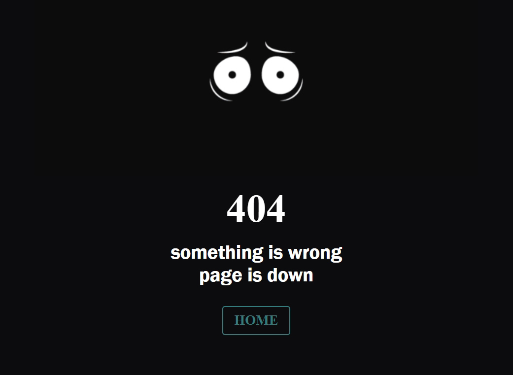

# Eyes-404

 
 

404 page made with HTML, CSS and added gif.
 Responcive design pc, tablet, mobile(phone).
 Button hover pulsing animation.
 Website was created to improve fron-end.

Site published at https://mantodinas.github.io/Eyes-404/

Designed and created by Mantas Petrauskas 
 more projects https://github.com/mantodinas

